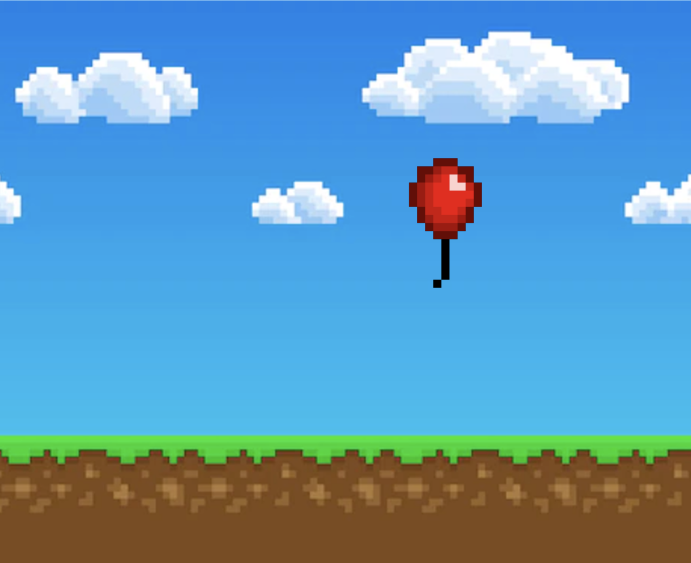

  

<h3 align="center">IOS Swift Game</h3>

---

This is a IOS Game made with Swift, this was used to learn more about swift. The game premise is avoiding obstacles as a missing balloon ventures into the atmosphere.
      

## 📝 Table of Contents

- [About](#about)
- [Authors](#authors)
- [Built Using](#️built_using)

## 🧐 About 

...

## ⛏️ Built Using 

-[Swift](https://swift.com)

## ✍️ Authors 

- [@mxcury](https://github.com/mxcury) - Idea & Work
